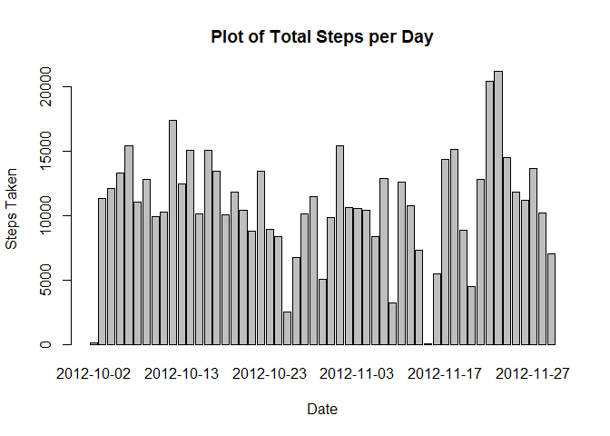
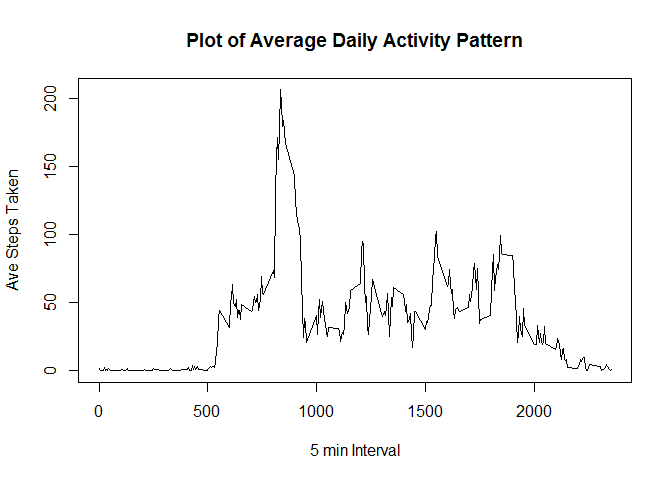
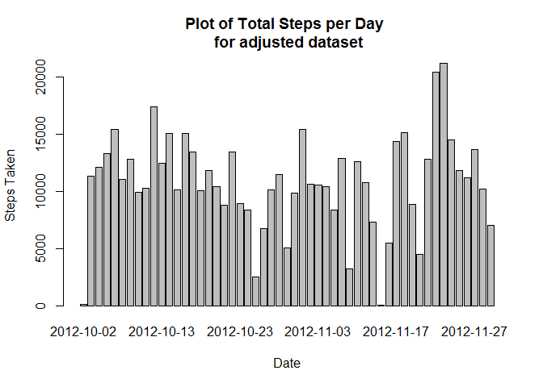
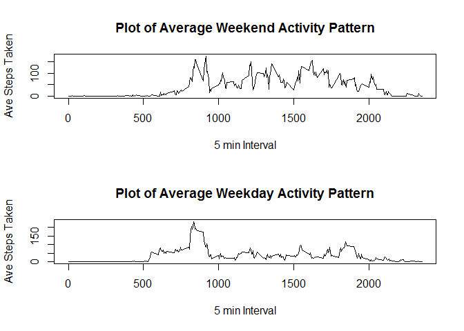

# Reproducible Research: Peer Assessment 1
#### By Mike Fusakio

## Loading and preprocessing the data

```r
library(dplyr)
```

```
## 
## Attaching package: 'dplyr'
## 
## The following objects are masked from 'package:stats':
## 
##     filter, lag
## 
## The following objects are masked from 'package:base':
## 
##     intersect, setdiff, setequal, union
```

```r
library(chron)
dataset <- read.csv("activity.csv", header = TRUE, dec = ".", sep = ",", na.strings = "NA")
dataset$date <- as.Date(dataset$date)
```


## What is mean total number of steps taken per day?
In order to find the total number of steps taken, group the data by date then
sum the values in the steps column while ignoring the NA value (default of aggregate function). Then plots the data in a histogram


```r
steps <- aggregate(steps ~ date, data = dataset, FUN = sum)
barplot(steps$steps, names.arg = steps$date, xlab = "Date", ylab = "Steps Taken", main = "Plot of Total Steps per Day")
```

 

What is the mean total number of steps taken per day?


```r
mean(steps$steps)
```

```
## [1] 10766.19
```
What is the median total number of steps taken per day?


```r
median(steps$steps)
```

```
## [1] 10765
```


## What is the average daily activity pattern?
Group the data by the 5 minute Interval data and then average that data


```r
Inter <- aggregate(steps ~ interval, data = dataset, FUN = mean)
plot(Inter, type = "l", xlab = "5 min Interval", ylab = "Ave Steps Taken", main = "Plot of Average Daily Activity Pattern")
```

 
Calculate which 5min interval has the max steps


```r
Inter$interval[which.max(Inter$steps)]
```

```
## [1] 835
```


## Imputing missing values
Calculate the total number of Missing Values


```r
sum(is.na(dataset$steps))
```

```
## [1] 2304
```

Fill in the Missing Values using the average for the day.  Also adds an average of 0 to the first day which is all N/A values.


```r
n = 1
newrow <- data.frame(date = "2012-10-01", steps = 0)
steps2bound <- rbind(steps, newrow)
while(n <= nrow(dataset)) {
  if(is.na(dataset[n,1])){
    date2 <- dataset[n,2]
    if(date2 %in% steps2bound){
      steps3 <- steps2bound[which(steps2bound$date == date2), ]
      steps3Ave <- steps3[,2]
      dataset[n,1] <- steps3Ave
    }  
    n = n + 1
  }
  if(!is.na(dataset[n,1])) {
    n = n + 1
  }
}

steps <- aggregate(steps ~ date, data = dataset, FUN = sum)
barplot(steps$steps, names.arg = steps$date, xlab = "Date", ylab = "Steps Taken", main = "Plot of Total Steps per Day \n for adjusted dataset")
```

 

What is the new mean for the adjusted data?


```r
mean(steps$steps)
```

```
## [1] 10766.19
```

What is the new median for the adjusted data?


```r
median(steps$steps)
```

```
## [1] 10765
```

Adjusting the dataset by replacing the NA values has had litle to no impact.


## Are there differences in activity patterns between weekdays and weekends?
Evaluate and add to the dataset if a date is a weekend (TRUE) or weekday (False)


```r
datasetDay <- mutate(dataset, Day = is.weekend(date))
```

Plot the Weekend vs Weekday Data by filtering the data set based on 
weekend vs weekday results into two new data sets. 


```r
Weekend <- filter(datasetDay, Day == "TRUE")
Weekday <- filter(datasetDay, Day == "FALSE")
InterDay <- aggregate(steps ~ interval, data = Weekday, FUN = mean)
InterEnd <- aggregate(steps ~ interval, data = Weekend, FUN = mean)
par(mfrow = c(2,1))
plot(InterEnd, type = "l", xlab = "5 min Interval", ylab = "Ave Steps Taken", main = "Plot of Average Weekend Activity Pattern")
plot(InterDay, type = "l", xlab = "5 min Interval", ylab = "Ave Steps Taken", main = "Plot of Average Weekday Activity Pattern")
```

 
